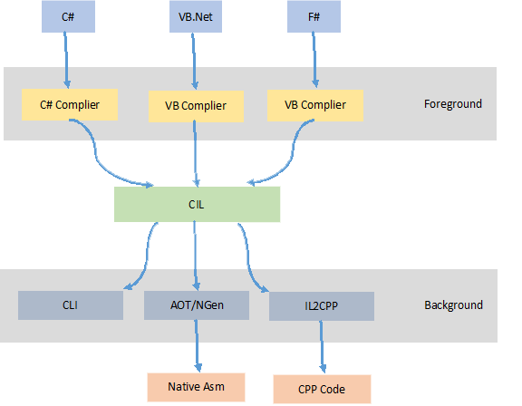

# 结构

当使用一个.Net语言时，程序源代码将通过各语言自己的编译器编译为CIL(Common Intermediate Language)语言程序集。一个.Net程序集是一个COFF格式的PE程序集，编译器发射的元数据和IL代码包含在该程序集的一个.text段中。

CLI(Common Language Infrastructure)是CIL的运行时环境，提供了包含执行引擎和GC在内的运行基础设施。

AOT设施用于将IL文件编译为特定于指定硬件平台的本地代码。对于微软实现的.Net Framework而言，NGen被用于类似的目的，然而即便程序集通过NGen重新生成，基于本地代码的程序集依然无法直接用于部署，而是作为经过JIT发射的代码缓存使用。

Unity3D特有IL2CPP用于将IL代码生成为C++代码。

# 谱系
.Net平台各设施的常见实现包括：

- **.Net Framework** 微软为Windows平台实现的.Net基础设施。目前已包含与Windows中，系为.Net各谱系中功能最为完备的一个；
- **CoreCLR** 微软建造的跨平台.Net基础设施，支持Windows，Linux和MacOS。CoreCLR与.Net Framework在CLI和BCL的实现方面是完全一样的，并使用相同的编译器；然而FCL规模要较少。CoreCLR主要用于赋予.Net服务器和命令行应用以跨平台运行的能力，并不具备Windows Forms或者WPF等界面组件；
- **Mono** 早先由Novell支持开发的平台实现。支持各类平台，且拥有与.Net Framework类似的功能。除了WPF之外，基本支持.Net Framework的各种功能。Mono的BCL和编译器正积极合并微软微软为开放CoreCLR而公开的代码；
- **Unity** 基于古老的Mono 2.4版本。在Unity3D 5.4.6版本当中，一个新的基于Mono 4的编译器被合入，然而功能状态暂时没有变化。

## 前端
前端编译器决定编译器支持的语言版本。对于特定的代码而言，如果其使用的语言特性并没有使用到需要新的版本CLI支持的特性，那么在较老版本的运行时上使用较新版本编译器编译出的程序集并非完全不可能，但是需要使用技术手段修改程序集.Net头中的MinorVersion字段。
.Net Framework和Core CLR所使用的编译器系为同一分支建造，被称为Roslyn编译器。

|谱系|最新版本|支持C#版本|
|:----------:|:-------------:|:-----------:|
|Roslyn|1.2.2|C# 6|
|Mono|4.4.2|C# 6|
|Unity|Mono 2.4 (Mono 4.4 in Unity3D 5.4.6)|C# 3|

## 后端
后端系为用以执行IL代码的JIT编译器，或者将IL发射为其他语言的二次编译系统以及其提供的运行时环境。.Net程序的运行时特征由后端决定。
对于使用JIT的情况，目前主流的遵循CLI标准建立的JIT包括.Net Framework和CoreCLR是用的CLR(Common Language Runtime，最新的版本亦使用其代号被称为RyuJIT)以及Mono，还有Unity所使用的经过修改的Mono 2.4版本。
对于使用AOT的情况，考虑到NGen是作为CLR的辅助设施而无法独立产生本地代码，实际上常见的是Mono AOT和Unity所使用的IL2CPP。

|// |RyuJIT|Mono|Mono(Unity3D)|Mono AOT|IL2CPP|
|:------:|:---------:|:---------:|:---------:|:----------:|:---------:|
|是否JIT|是|是|是|否|否|
|输出类型|NA|NA|NA|Native|C++|
|运行时版本(相对于CLR)|4|4|2|2|2|
|GC类型|3 Gens GC (gen0, 1: Marked-Compact, STW; gen2: Marked-Sweep)|SGen (gen0:Copying; gen1:Marked-Sweep)|Boehm|Boehm|Boehm|
